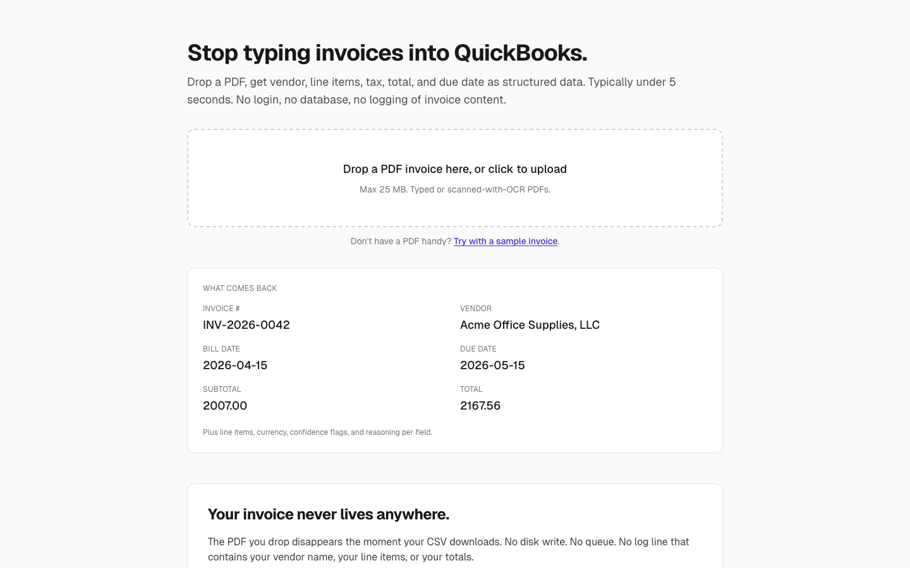
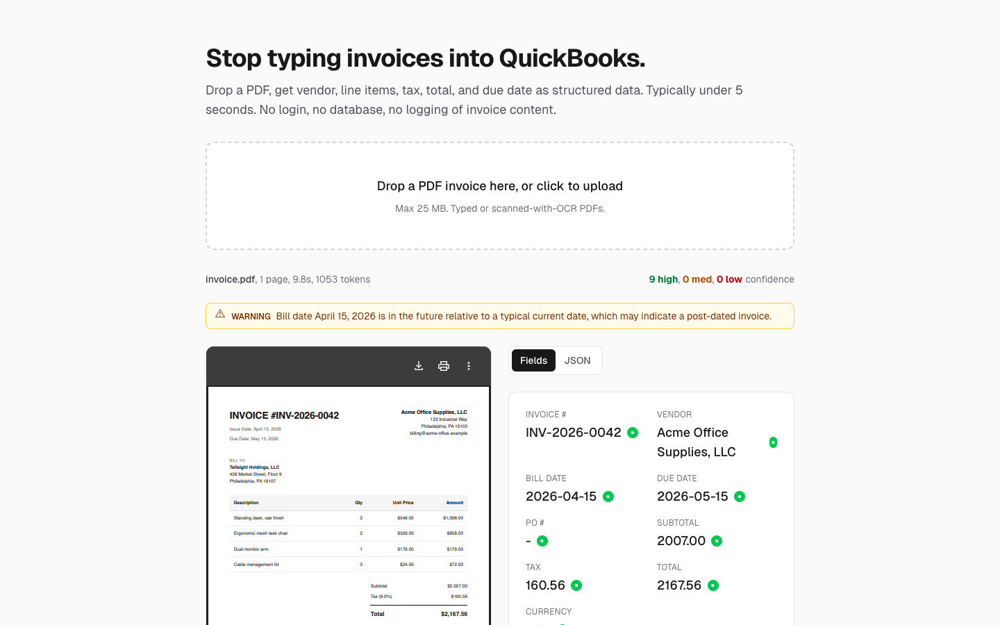
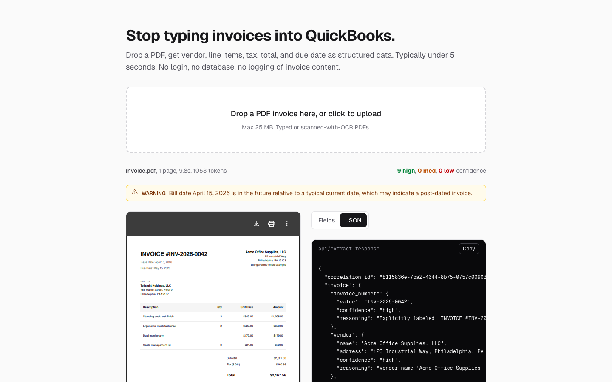
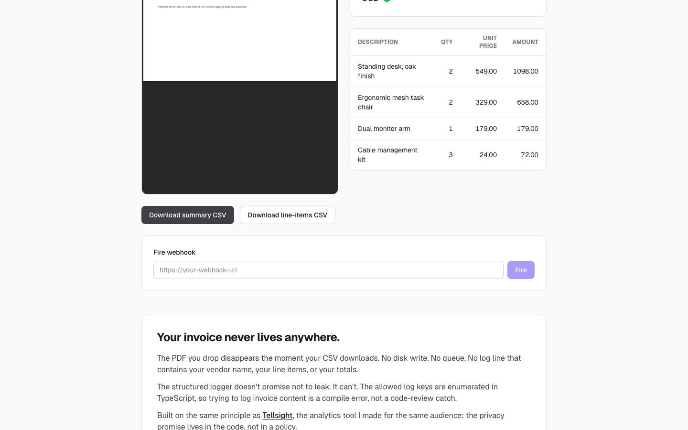
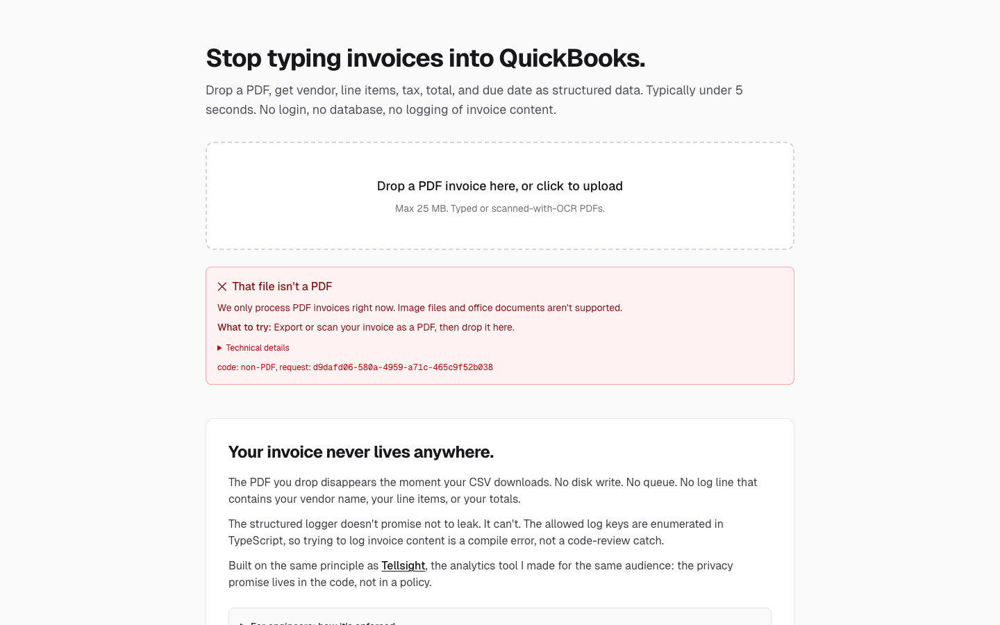

<p align="center">
  
</p>

<p align="center">
  <a href="https://invoiceflow-cs.vercel.app"></a>
  <a href="https://github.com/coreystevensdev/invoiceflow/actions/workflows/ci.yml"></a>
  
</p>

# InvoiceFlow

Drop a PDF invoice and get vendor, line items, tax, total, and due date back as structured JSON in about five seconds. Each field includes the source text Claude used to extract it, surfaced through a hover or focus tooltip. Export to CSV (QuickBooks or Xero schema) or POST the result to a webhook URL.

There's no login or database. PDFs process in memory inside a single Vercel Function and disappear when the request ends.

<p align="center">
  
</p>

<p align="center">
  
</p>

<table>
<tr>
<td width="50%"></td>
<td width="50%"></td>
</tr>
<tr>
<td colspan="2"></td>
</tr>
</table>

**Stack:** Next.js 16 · React 19 · TypeScript · Tailwind 4 · `@anthropic-ai/sdk` · `pdf-parse` · `zod`

## Run locally

```bash
cp .env.example .env.local
# paste your Anthropic API key into .env.local
npm install
npm run dev
```

Open http://localhost:3000 and drop a PDF.

## Routes

| Route | Method | What it does |
|---|---|---|
| `/` | GET | Landing + extraction UI |
| `/api/extract` | POST (multipart) | `pdf` form field returns an `ExtractResponse` JSON |
| `/api/csv` | POST (JSON) | `{invoices, format: "summary" \| "line_items"}` returns a CSV download |
| `/api/webhook` | POST (JSON) | `{webhook_url, invoice, verbose?}` POSTs to your URL |
| `/robots.txt`, `/sitemap.xml`, `/schema.jsonld` | GET | SEO surfaces |

Every API response carries a `correlation_id` (UUID v4) for log lookups. Errors are typed; the discriminated union lives in `src/lib/errors.ts`.

## How it works

```
Browser              Vercel Function                       Anthropic API
  │                         │                                    │
  │ ── POST PDF ─────────>  │                                    │
  │                         │  rate-limit by IP                  │
  │                         │  pdf-parse → text + page count     │
  │                         │                                    │
  │                         │ ── messages.parse(sys+user) ────>  │
  │                         │   system prompt cached             │
  │                         │   Zod schema enforces output       │
  │                         │ <── parsed_output, usage ────────  │
  │                         │                                    │
  │                         │  deterministic flags + merge       │
  │                         │  cost guard: 3× rolling median?    │
  │                         │  log usage by correlation id       │
  │ <── JSON + corr. id ──  │                                    │
```

Everything inside the function is one Node.js process. No queue, no worker, no background job. Vercel's Fluid Compute reuses the instance across concurrent requests, so the in-memory cost history and rate-limit buckets persist across warm invocations (per-instance, not globally, see "Known limitations").

## File layout

```
src/
├── app/
│   ├── page.tsx                  Upload UI + reasoning tooltips
│   ├── layout.tsx                Metadata, OG, Twitter, JSON-LD link
│   ├── globals.css               :focus-visible ring + reduced-motion guard
│   ├── api/extract/route.ts      PDF → Claude → structured JSON
│   ├── api/csv/route.ts          Invoice JSON → CSV (QBO or Xero)
│   ├── api/webhook/route.ts      Invoice JSON → POST to user URL
│   └── schema.jsonld/route.ts    SoftwareApplication structured data
├── components/
│   ├── error-state.tsx           ErrorState for all 8 error categories
│   └── upgrade-browser-notice.tsx
├── lib/
│   ├── claude.ts                 System prompt + Zod schema + extractInvoice()
│   ├── pdf.ts                    pdf-parse wrapper with typed errors
│   ├── validate.ts               Cross-field validation
│   ├── csv.ts                    Summary + line-item CSV formatters
│   ├── errors.ts                 ExtractionErrorCode union + toErrorResponse
│   ├── log.ts                    Structured correlation-ID logger (allowlist)
│   ├── cost.ts                   Rolling-median cost ceiling
│   ├── rate-limit.ts             Sliding-window limiter
│   └── site.ts                   Canonical URL helper
└── proxy.ts                      Next.js 16 middleware: nonce CSP, HSTS
```

## Design decisions worth calling out

**Per-field confidence and reasoning.** Every extracted field is a `{value, confidence, reasoning}` tuple. Hover or focus a field to see the source-cited reasoning. The tooltip is keyboard-accessible (Tab to reveal, Escape to dismiss) and wired to the field via `aria-describedby`.

**Two-pass validation.** Claude flags cross-field issues during extraction. A deterministic pass in `lib/validate.ts` runs independently and merges its findings. Either alone misses things the other catches.

**Zero retention.** No database, no auth, no content logging. Uploaded PDFs process in memory within a single Vercel Function execution. The structured logger in `src/lib/log.ts` only emits an allowlisted set of metadata keys: `pdf_size_bytes`, `pdf_num_pages`, `correlation_id`, `error_code`, `cost_usd`, `retry_count`. Field values and PDF bytes never reach the log stream.

**Typed error taxonomy.** Eight error codes (`corrupt-PDF`, `oversized-PDF`, `non-PDF`, `not-an-invoice`, `model-API-failure`, `rate-limited`, `extraction-timeout`, `cost-budget-exceeded`) each map to a user-readable title, cause, and next-step copy via the shared `ErrorState` component. Raw 5xx responses never reach the client. Adding a new error path is a `Record<...>`-typed change that won't compile if you forget any of the three places it has to be wired.

**Strict nonce-based CSP.** `src/proxy.ts` generates a per-request nonce, sets the CSP header, and ships HSTS, Referrer-Policy, X-Content-Type-Options, and Permissions-Policy alongside it. No `'unsafe-inline'`. JSON-LD structured data is served at a dedicated `/schema.jsonld` route rather than as an inline `<script>`, because the strict CSP would block it.

**WCAG 2.1 AA baseline.** Keyboard-operable everywhere, `aria-live` status updates during extraction, icon and text status indicators (color is never the only signal), `prefers-reduced-motion` honored globally, focus rings visible on every interactive element.

**Universal CSV schema.** Imports cleanly into QuickBooks Online's CSV importer, into Xero, and opens in Excel and Google Sheets. ISO-8601 dates, numeric money, UTF-8 with BOM.

**Prompt caching.** The ~500-token system prompt uses `cache_control: { type: "ephemeral" }`. After the first call in a cache window, the system-prompt fraction of cost drops by roughly 90%.

**Structured output.** `messages.parse()` plus `zodOutputFormat(InvoiceExtractionSchema)` validates Claude's response against the Zod schema inside the SDK. No hand-rolled JSON parsing or defensive type guards scattered through the codebase.

**Cost and retry safety.** 90-second Claude timeout, max 2 retries with exponential backoff, 3× rolling-median cost ceiling, and an absolute first-request guard. Constants and roles in the table below.

## Why Claude

I picked Claude as the reader rather than building OCR plus rules because:

1. An invoice's structure (vendor name vs line item vs grand total) requires understanding what an invoice *is*, not just transcribing characters. Frontier LLMs do this without training data or per-layout rules.
2. `messages.parse(...)` with `zodOutputFormat(InvoiceExtractionSchema)` validates the response against a Zod schema inside the SDK. Malformed output throws at the SDK boundary, so the rest of the codebase can trust the shape.
3. Each field comes back with its own reasoning string citing the source text. The tooltip UI is a thin renderer; the credibility comes from the model.
4. Prompt caching is supported via `cache_control`. The system prompt is identical on every request, so cached tokens dominate after the first call.
5. Confidence and cross-field flags come from the same call. No second model, no ensembling.

Alternatives considered:

| Option | Why not |
|---|---|
| OCR only (Tesseract, AWS Textract) | Returns characters. Structure inference still requires a second model or hand-written rules. |
| Regex over extracted text | Breaks on every new invoice layout. Maintenance grows without bound. |
| Fine-tuned extraction model | Needs labeled data and an ML ops loop. Out of scope for this scale. |
| Other frontier LLMs (GPT-4 class, Gemini) | Quality is comparable. Anthropic's Zod output helper and ephemeral caching tipped the call. The model is env-swappable via `CLAUDE_MODEL`; the rest of the pipeline is vendor-neutral at the JSON-schema seam. |

## Cost model

Per-extraction cost for a typical single-page invoice (~1,500 input tokens, ~800 output tokens):

| Model | Input $/MTok | Output $/MTok | Per extraction | Steady state with caching |
|---|---|---|---|---|
| `claude-haiku-4-5` | $1 | $5 | ~ $0.006 | ~ $0.005 |
| `claude-sonnet-4-6` (default) | $3 | $15 | ~ $0.017 | ~ $0.014 |
| `claude-opus-4-7` | $15 | $75 | ~ $0.083 | ~ $0.070 |

Sonnet 4.6 is the default because it handles the long tail (handwritten receipts, multi-page statements, non-English invoices) where Haiku tends to flag low confidence. Opus is available via `CLAUDE_MODEL` when the extra accuracy is worth roughly 5× the spend.

### Defense in depth

Defined in `src/lib/claude.ts` and `src/lib/cost.ts`:

| Guard | Value | Role |
|---|---|---|
| `EXTRACTION_MAX_TOKENS` | 4096 | Hard cap on output tokens per request |
| `EXTRACTION_MAX_RETRIES` | 2 | Transient failures retry twice with exponential backoff, then surface `model-API-failure` |
| `EXTRACTION_TIMEOUT_MS` | 90,000 | `AbortSignal.timeout`; slow calls fail as `extraction-timeout` |
| `ABSOLUTE_CEILING_USD` | $1.00 | Single extractions above this abort as `cost-budget-exceeded`. Catches the very first request before any history exists. |
| `CAP_MULTIPLIER × rolling median` | 3× | After a few extractions, requests above 3× the median abort. Catches layout explosions, prompt-injection that balloons output, or misconfigured prompts. |

Every request emits one structured JSON log line including `cost_usd`, `retry_count`, `pdf_size_bytes`, and `pdf_num_pages`. Operators can eyeball the distribution in Vercel logs without standing up a dashboard.

## Known limitations

A few honest gaps:

- **No persistence.** Zero retention is a feature, but any workflow needing history or resume-on-failure has to be rebuilt on top.
- **In-memory rate limiter and cost history.** Per Fluid Compute instance, not globally shared. The 20/hr extract cap is effectively 20/hr × instance count under horizontal scale. Migration target is Redis or Vercel KV.
- **`pdf-parse` is text-only.** Image-only PDFs (scanned receipts without OCR) come back as `not-an-invoice`. Handwritten receipts need an OCR pre-pass that doesn't exist here yet.
- **Model pricing is hard-coded in `src/lib/cost.ts`.** Adding a new model means adding a pricing row, or the anomaly cap silently fails open. Documented in the file header.
- **JSON-LD served at `/schema.jsonld`, not inline.** Google prefers inline `<script type="application/ld+json">`; linked structured data is best-effort across crawlers.
- **Unit tests cover the pure-logic library only.** Vitest covers `cost.ts`, `errors.ts`, `validate.ts`, `rate-limit.ts`, and `csv.ts`. No integration tests against the route handlers, no end-to-end coverage of the upload flow.

## Deploy

```bash
npx vercel          # preview
npx vercel --prod   # production
```

Required env: `ANTHROPIC_API_KEY`. Optional: `CLAUDE_MODEL` (default `claude-sonnet-4-6`), `SITE_URL`, `MAX_PDF_SIZE_MB`. See `.env.example`.

## Sister project

[**Tellsight**](https://github.com/coreystevensdev/tellsight) applies the same Claude + privacy-first approach to interpreting business data rather than extracting it. The two compose: InvoiceFlow turns PDF invoices into CSVs; Tellsight reads CSVs and explains what's in them.

## License

[MIT](LICENSE)
